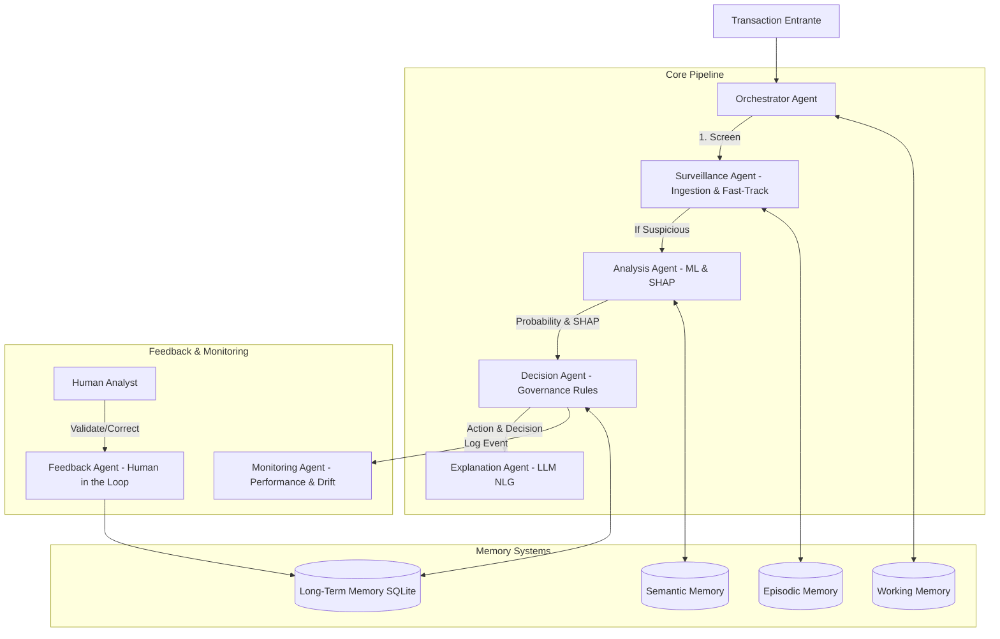

# Architecture Technique — Agentic AI pour la Détection de Fraude Bancaire

> **Framework de référence** : Blueprint 8 étapes ("How to Build an AI Agent", AIForLeaders)  
> **Projet** : Détection de Fraude Bancaire avec Federated Learning & Agentic AI  
> **Date** : August 2026  
> **Auteurs** : Équipe R&D / Stage AI & Cybersecurity  

---

## Vue d'Ensemble de l'Architecture

Cette documentation détaille l'architecture complète du système **Agentic AI** conçu pour la détection de fraude bancaire en temps réel. Le système repose sur une organisation multi-agents modulaire et orchestrée, intégrant le **Federated Learning** et l'**Explainable AI (SHAP & LLMs)**.



---

## Alignement sur le Blueprint en 8 Étapes

### Étape 1 — Purpose & Scope (Objectif & Périmètre)
* **Objectif** : Détecter et expliquer les transactions bancaires frauduleuses en temps réel avec un taux de faux positifs minimal.
* **Besoins Utilisateurs** : Analystes de conformité bancaire, équipes de gestion du risque, régulateurs (RGPD / DORA).
* **Critères de Succès** :
  * F1-Score > 0.80 sur modèles fédérés
  * Latence Fast-Track < 5 ms (60-75% des transactions autorisées immédiatement)
  * Rapport en langage naturel généré en < 2 secondes
* **Contraintes** : Confidentialité stricte des données bancaires (Federated Learning obligatoire).

---

### Étape 2 — System Prompt Design (Ingénierie des Prompts)
Le système s'appuie sur des rôles d'agents bien définis et des consignes strictes (Guardrails) pour l'Agent 4 (`ExplanationAgent`) :

```markdown
SYSTEM CONTEXT :
Tu es un expert senior en détection de fraude bancaire avec 15 ans d'expérience.
Tu analyses des transactions suspectes et rédiges des rapports professionnels pour la conformité.

CONSIGNES & GUARDRAILS :
1. Rédige un rapport de 4 à 6 phrases en français professionnel.
2. Explique POURQUOI la transaction a été bloquée ou signalée.
3. Cite obligatoirement les 2-3 features SHAP les plus déterminantes et leur valeur.
4. Ne jamais inventer de faits non présents dans le contexte.
```

---

### Étape 3 — Choose LLM (Choix du Modèle de Langage)
* **Modèle Principal** : **Google Gemini 2.5 Flash** (via le SDK `google-genai`).
* **Paramètres** : `Temperature = 0.3` (réponses factuelles), `Max Output Tokens = 500`.
* **Fallback Strategy** : Si l'API cloud n'est pas accessible ou rencontre un quota (HTTP 429/403), le système bascule automatiquement sur un template de rapport structuré hors-ligne (zero-downtime).

---

### Étape 4 — Tools & Integrations (Outillage & Intégrations)
Le framework fournit des outils abstraits héritant de `BaseTool` :

| Outil | Rôle / Capacité | Module |
|:---|:---|:---|
| **`MLModelTool`** | Inférence ML (XGBoost, Random Forest, MLP) | `scripts/agents/core/tools.py` |
| **`SHAPExplainabilityTool`** | Calcul d'explicabilité locale SHAP | `scripts/agents/core/tools.py` |
| **`LLMGatewayTool`** | Passerelle unifiée d'appel aux LLMs | `scripts/agents/core/tools.py` |
| **`AlertTool`** | Notification des équipes (Email, Slack, Webhooks) | `scripts/agents/core/tools.py` |
| **`DatabaseTool`** | Interrogation SQL de l'historique et des décisions | `scripts/agents/core/tools.py` |
| **`FederatedLearningTool`** | Coordination des rounds FedAvg | `scripts/agents/core/tools.py` |

---

### Étape 5 — Memory Systems (Systèmes de Mémoire)
Une architecture mémoire à 4 niveaux assure le maintien du contexte :

```
┌─────────────────────────────────────────────────────────────────┐
│ 1. Working Memory   : Transaction en cours (RAM volatile)      │
│ 2. Episodic Memory  : N dernières transactions (Deque FIFO)     │
│ 3. Semantic Memory  : Base de patterns de fraude connus (Rules) │
│ 4. Long-Term Memory : Persistance SQLite (Audit Trail & Stats)  │
└─────────────────────────────────────────────────────────────────┘
```

---

### Étape 6 — Orchestration (Workflow Adaptatif)
L'`OrchestratorAgent` oriente dynamiquement les transactions selon 4 workflows :

1. **`fast_track`** : `SurveillanceAgent` seul → Décision `ALLOW` immédiate (latence < 5 ms).
2. **`standard`** : `Surveillance` → `Analysis` → `Decision` → `Explanation`.
3. **`escalation`** : Inclut la notification prioritaire et la mise en attente d'un avis humain.
4. **`deep_analysis`** : Analyse approfondie avec recherche de patterns sémantiques.

---

### Étape 7 — User Interface (Interface Utilisateur)
* **API / CLI** : Démonstrateur `pipeline_demo.py`.
* **Tableau de Bord HTML** : `report/architecture_diagram.html` offrant une vue d'ensemble interactive et visuelle de la chaîne d'agents et des métriques.

---

### Étape 8 — Testing & Evals (Évaluation & Métriques)
Le module `AgentMetrics` mesure en continu :
* **Latence P50 / P99** par agent et par pipeline.
* **Taux de précision / F1-Score** vs feedback des analystes.
* **Taux d'utilisation Fast-Track** (cible > 60%).

---

## Conclusion & Prochaines Étapes
L'architecture multi-agents conçue transforme les modèles de Machine Learning en un **système autonome, explicable et gouverné**, parfaitement aligné avec les contraintes réglementaires bancaires (RGPD, DORA, AI Act).
